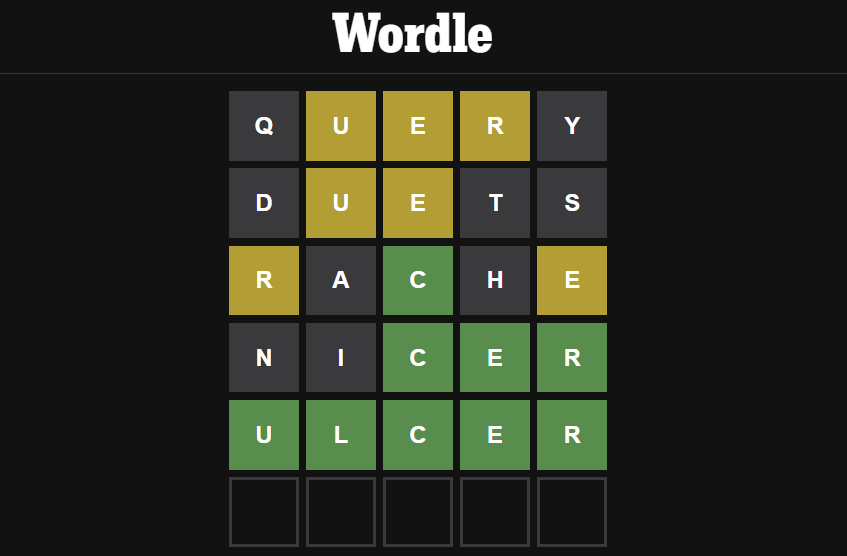
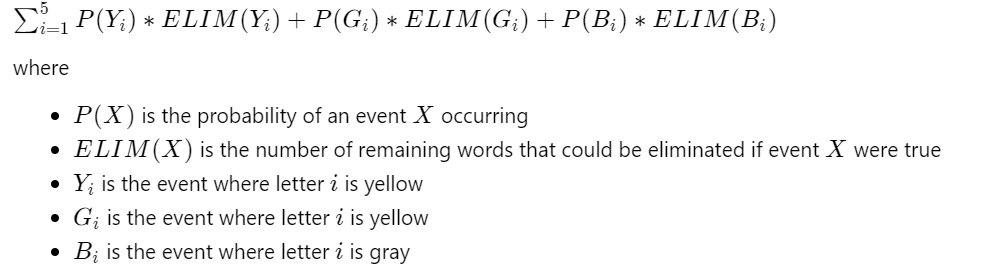

# Wordle-Utility

## Note

**This project is in progress. The description in this README includes statements about what this project *will do* once complete. However, it is currently a work in progress.**

## About

This is a utility program that can be used by a human to help play the popular online word-guessing game [Wordle](https://www.nytimes.com/games/wordle/index.html). It can be run on the command-line and provides an interface for the user to input what guess they chose and the feedback the game gave and uses the information to calculate what they should use as their next guess. 

## Usage Instructions

On Unix-based systems, the provided Makefile can be used to compile the program from the project directory with `Make`. The program can then be run by performing `./wordle-utility <filename>` where `<filename>` is the path to a file containing a newline separated list of valid words (each of length 5). There exists one such file at `/word_lists/new_words.txt`. 

## What's Wordle?

[Wordle](https://www.nytimes.com/games/wordle/index.html) is an online word-guessing game in which the player is trying to guess a secret 5-letter word. Each guess the player makes must be a valid 5-letter word. After each guess they make, the game provides feedback on how good their guess was by coloring each letter according to these rules:
* Gray: this letter does not appear in the secret word.*
* Yellow: this letter appears in the secret word, but not at this position.
* Green: this letter appears in the secret word at this position.

Here is an example of a completed game where the word was "ulcer":

## The Algorithm

The program uses an algorithm to rank guesses. The algorithm analyzes each potential guess, assigning it a value based on how good of a guess it is. This value is determined by the following equation:

<!-- LaTeX version of the equation:

$\sum_{i=1}^{5} P(Y_i) * ELIM(Y_i) + P(G_i) * ELIM(G_i) + P(B_i)*ELIM(B_i)$

where 
* $P(X)$ is the probability of an event $X$ occurring
* $ELIM(X)$ is the number of remaining words that could be eliminated if event $X$ were true
* $Y_i$ is the event where letter $i$ is yellow
* $G_i$ is the event where letter $i$ is yellow
* $B_i$ is the event where letter $i$ is gray

-->

Once each word is assigned a value based on this equation, the words are then sorted in descending order based on their value. This leaves the words likely to lead to the greatest advantage for the player at the top of the list.

## Mixing the Algorithm with Gameplay

This program is a Wordle *utility*. It is not a Wordle solver. Its intention is to provide a human user with statistically-backed information that this user can subsequently used to make decisions about what words to play in the game. The user interacts with an actual Wordle game, telling the program about what word they chose to guess and what feedback they received. The utility then uses its algorithm to provide the user with the best options for the next guess. One important point about Wordle is that the word list contains many uncommon words, but the spirit of the game is that the final answer will always be a common word. Thus, the utility gives the user the option to peruse a selected number of top guesses and they can chose one that they believe to be a potential answer. The utility also makes no decisions about when to go for the win; this is left up to the user. The utility will continue to suggest guesses that can be ruled out as potential answers. The program isn't worried about winning the game, it simply suggests the words that will rule out the most words, in order to narrow down the potential guessing pool as much as possible. However, the user is told whether guesses could potentially be the answer or not, so they can decide to only use these guesses at an end-game stage.
